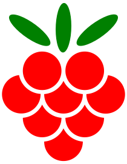

## Malina.js Example

Malina.js builds your web-application to use it **without framework on frontend side**. 
Therefore your web-app becomes thinner and faster, and the application itself consist of **vanilla JavaScript**.

In this example;
- Routing using Navaid.
- Splitting code.
- Backend using Derver.

